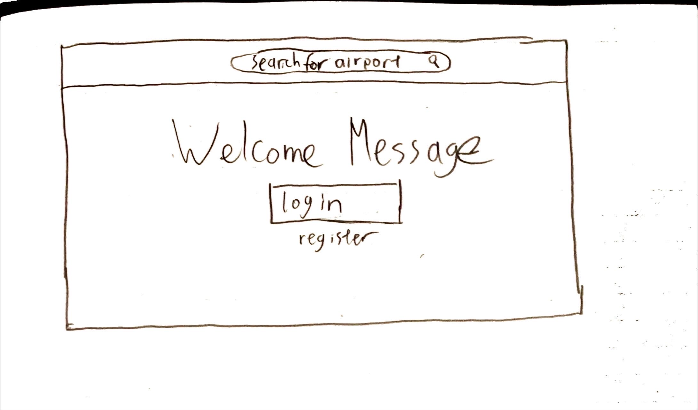
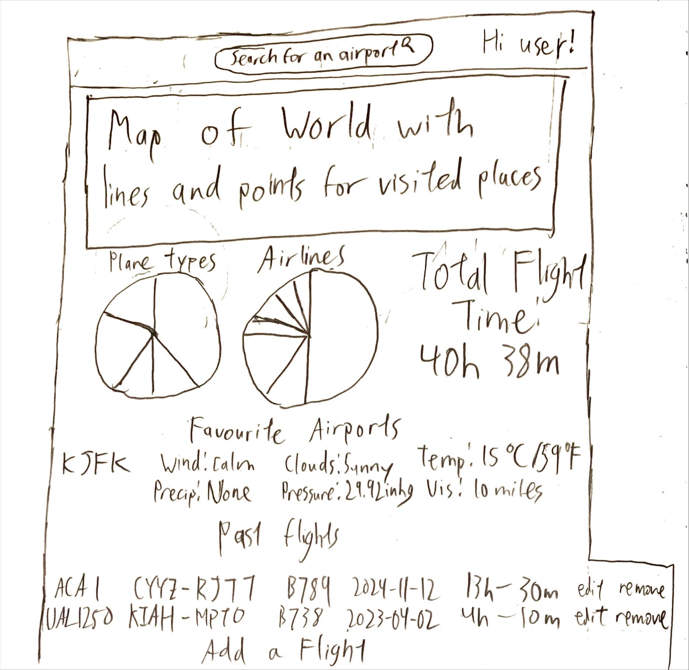
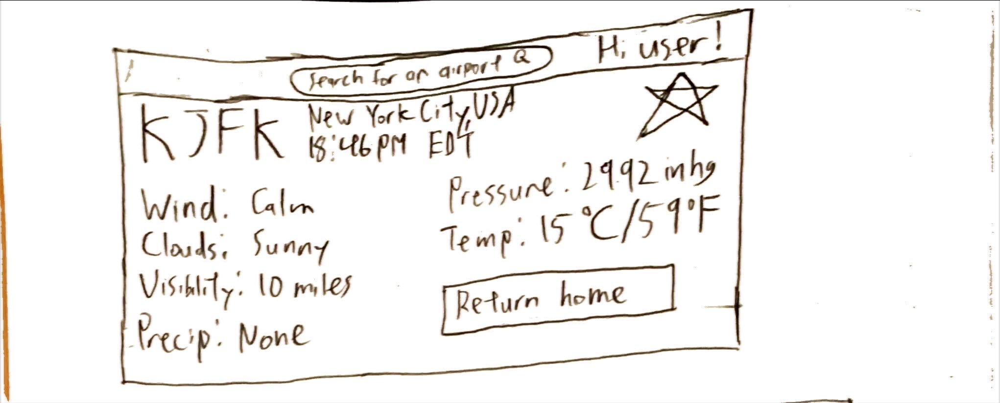
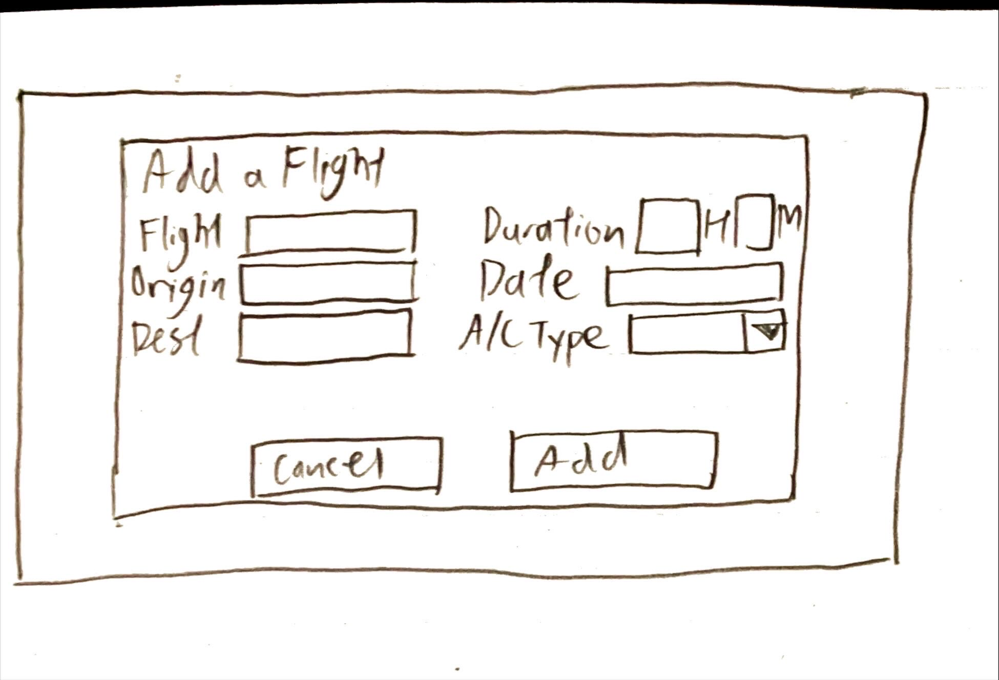
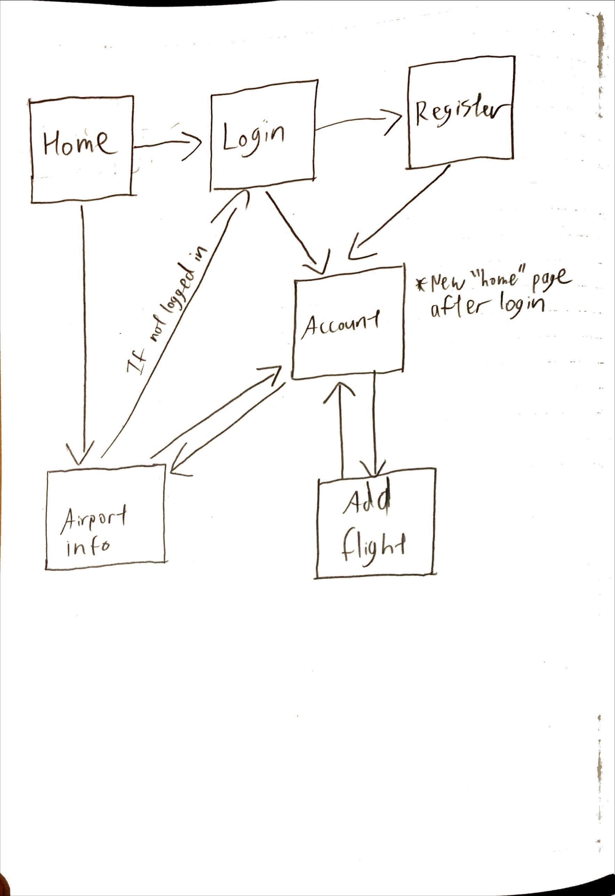

# Flight Dashboard 

## Overview

The Aviation Dashboard is a web application that allows users to log and track their flight hours, places they've flown, and record time spent with different airlines and aircraft types.

Furthermore, users will be able to find current and future weather information at airports. 


## Data Model

The application will store Users and Flight lists

* users each contain a list of referenced flights


An example User with referenced list of flights:

```javascript
{
  username: "SamuelYang",
  password: //hashed password
  flights: //Array of referenced flight documents
  flight_time: "40H22M" //String, will be converted to time IF ever needed
}
```

An example Flight

```javascript
{
  user: // reference to user
  flight: "ACA1",
  airline: "ACA",
  origin: "CYYZ",
  destination: "RJTT",
  duration: "13H30M" //String, will convert to time separately when needed
  date: "2024-11-15" //Type Date
  type: "B789"
}
```

## [Link to Commented First Draft Schema](db.mjs) 

## Wireframes

(__TODO__: wireframes for all of the pages on your site; they can be as simple as photos of drawings or you can use a tool like Balsamiq, Omnigraffle, etc.)

/home - home page before logging in



/register - register and login as new user


/account - display account information



/airport - display airport weather



/add - add a flight



## Site map



## User Stories

1. As a non-registered user, I want to search up airports so that I can see current weather information
2. As a user, I want log in to the site so that I can see my information
3. As a user, I want to add a flight to my account so that I can record my flight information
4. As a user, I want to view my past flight history and statistics so that I can see my travels in an interactive way

## Research Topics

* Client-side javascript modules and libraries (leaflet, chartjs)

  * What is it? Libraries to generate visuals for the website to display

  * Why use it? Display data to the user in an interactive way

  * Possible Candidates: leaflet, chartjs

  * Points: 4

* Server-side javascript modules and libraries (passportjs)

  * What is it? Middleware for authentication with Node.js

  * Why use it? Create more robust login and authentication systems

  * Possible Candidates: Passportjs with LocalStrategy(ies)

  * Points: 4

* External API Integration

  * What is it? APIs provide the ability to integrate third-party resources into an application.

  * Why use it? Allows users to view live airport weather information 

  * Possible Candidates: aviationweater.gov API

  * Points: 3


11 points total out of 10 required points 

## [Link to Initial Main Project File](./src/app.mjs) 

## Annotations / References Used
* All acknowledgements are in [acknowledgements](./Acknowledgements.md)